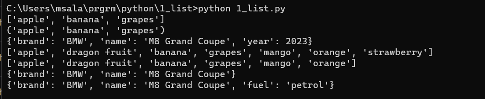

# LIST,TUPLE,DICTIONARY

## Code :

To view code [click here](./1_list.py)

## Algorithm :


```Algorithm
    step 1: Open python application
    step 2: Start file -> new file
    step 3: Open python shell
    step 4: Write code for python tuples,dictionary and tuple
    step 5: Save file as list.py
    step 6: Stop the process
```

## Output :



To view Output [click here](./output.png)