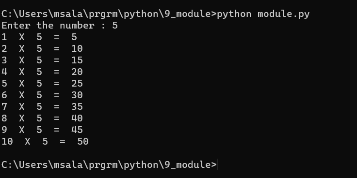

# MODULE

## Code :

To view code [click here](./module.py)

To view importing module code [click here](./multmodule.py)

## Algorithm :


```Algorithm
    step 1: Open python application
    step 2: Select file -> new file
    step 3: Write code for implementing modules
    step 4: Save file as module.py
    step 5: Select run and run module
    step 6: Verify the result and stop the process
```

## Output :



To view Output [click here](./output.png)